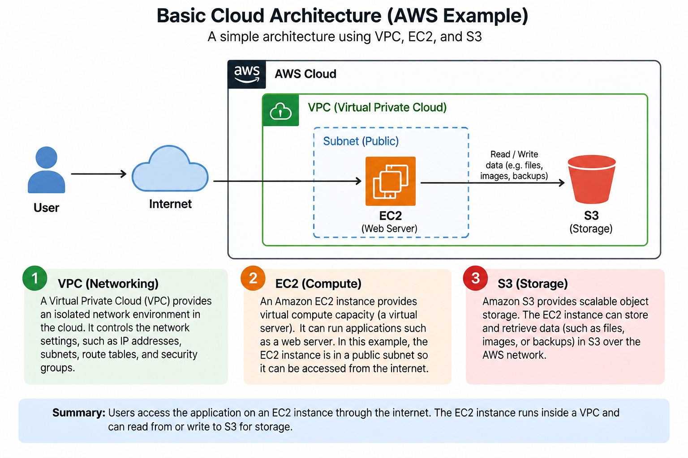
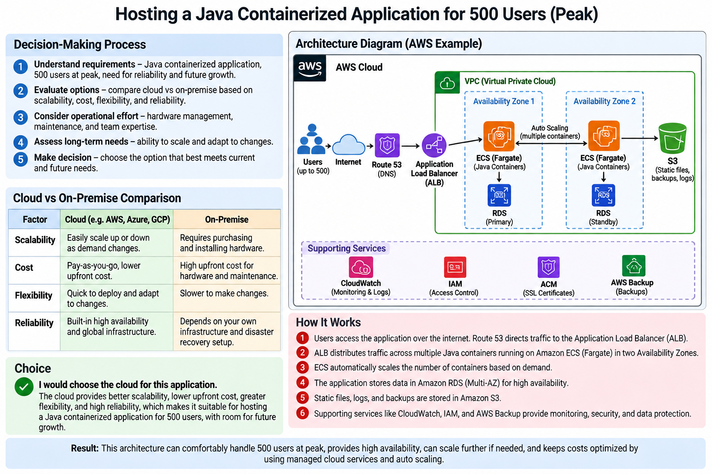
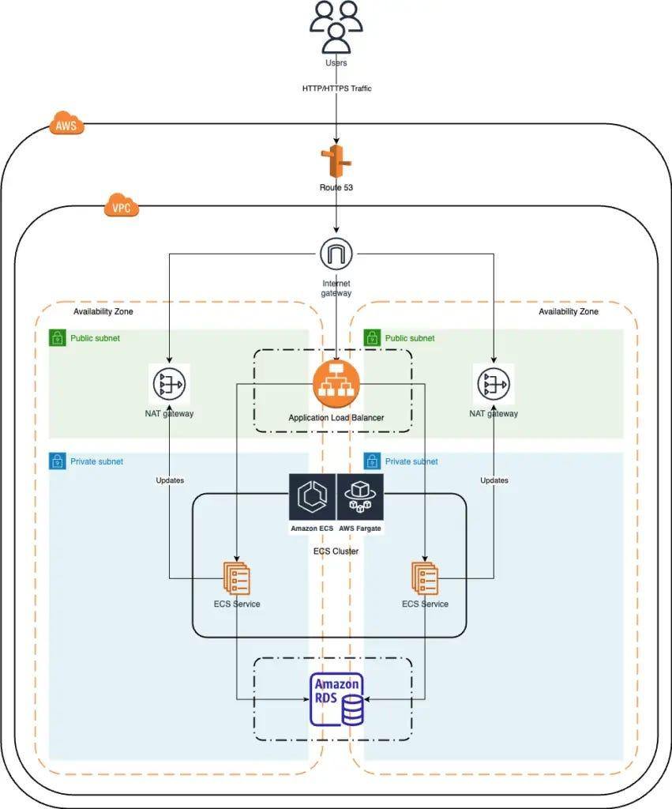
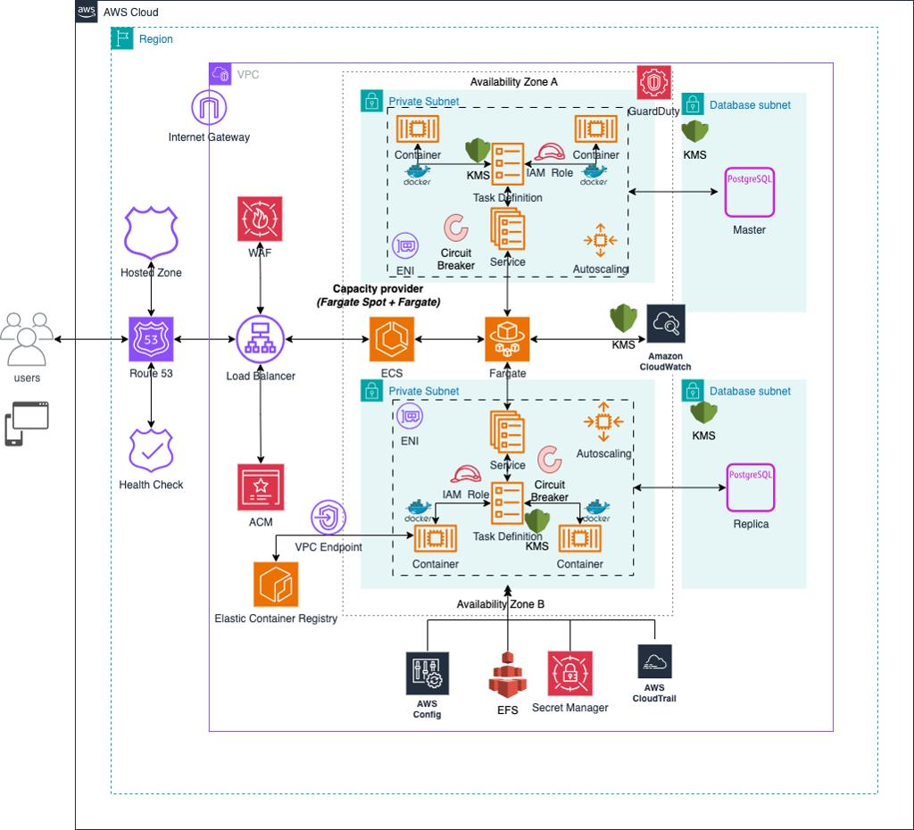
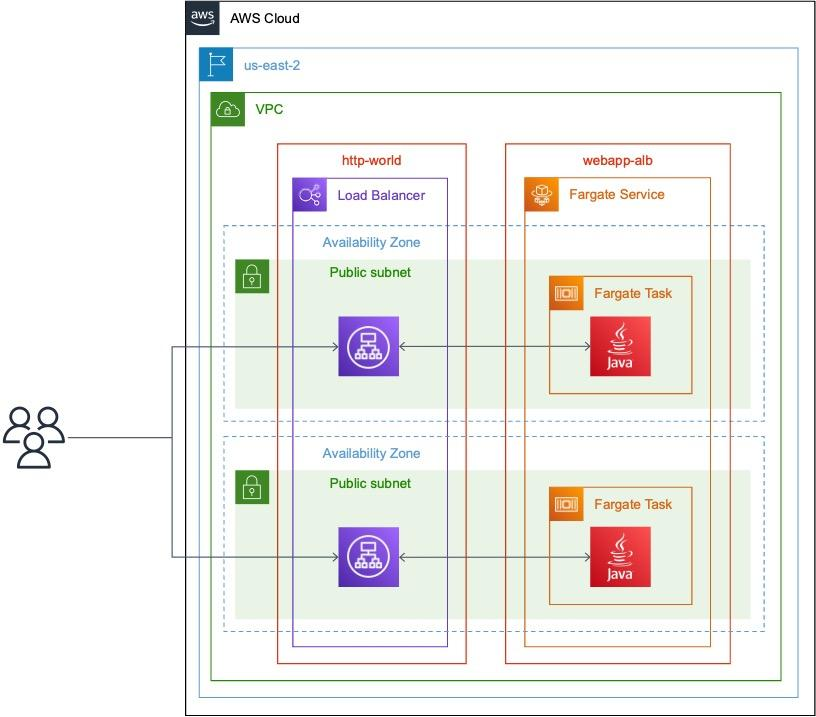

# AWS Research Questions

## Introduction to Cloud Computing Concepts

1. **What is Cloud Computing?**

    Define cloud computing in your own words and describe its basic characteristics (on-demand access, scalability, etc.). How does cloud computing differ from traditional on-premise infrastructure?

    **Cloud computing is the delivery of computing resources such as servers, storage, databases, networking, and software over the internet instead of having to own and manage all the physical equipment yourself. In my own words, it means I can use the computing resources I need when I need them and pay for what I use.**

    **Basic Characteristics of Cloud Computing**

    - **On-demand access:** Resources can be accessed whenever they are needed without waiting for new hardware to be installed.

    - **Scalability:** Resources can be increased or reduced depending on the workload. For example, a website can use more servers when traffic increases.

    - **Pay-as-you-go:** Users generally pay based on the resources they consume rather than buying expensive hardware upfront.

    - **Accessibility:** Cloud services can be accessed from different locations and devices through the internet.

    - **Resource sharing:** Cloud providers share their large pools of computing resources among many customers.

    - **Reliability:** Cloud providers often use backup systems and multiple data centers to reduce downtime.

    **Cloud Computing vs Traditional On-Premise Infrastructure**

    |Cloud Computing|Traditional On-Premise|
    |--------------|--------------|
    |Resources are provided through the internet|Resources are hosted on the organization's own premises.|
    |Usually requires less upfront investment|Requires purchasing servers, storage, and networking equipment|
    |Resources can be scaled quickly|Scaling may require purchasing and installing more hardware|
    |Cloud provider manages much of the infrastructure|Organization is responsible for maintaining the infrastructure|
    |Usually uses a pay-as-you-go model|Organization pays for and owns the hardware|
    |Can be accessed remotely|Access may depend more on the organization's physical network|

    ***In Summary Cloud computing provides flexible computing resources without requiring an organization to own and maintain all the physical infrastructure. Traditional infrastructure gives an organization more direct control over its hardware, but it usually requires more upfront cost, maintenance, and planning for future growth.***

2. **Types of Cloud Computing Services**

    Explain the differences between Infrastructure as a Service (IaaS), Platform as a Service (PaaS), and Software as a Service (SaaS). Provide examples of each and their use cases in the cloud.

    **Types of Cloud Computing Services**

    **Cloud computing services are commonly divided into IaaS, PaaS, and SaaS. The main difference is how much of the IT infrastructure the cloud provider manages for the user**

    |Service|What it provides|Example|Common use case|
    |-------|------|------|-------|
    |IaaS|Virtual servers, storage, networks, and other infrastructure| Amazon EC2, Microsoft Azure Virtual Machines|Hosting websites, applications, and databases|
    |PaaS|A ready-made platform for developing and running applications|Google App Engine, Heroku|Developing and deploying applications without managing servers|
    |SaaS|Complete software applications accessed over the internet|Gmail, Microsoft 365, Salesforce|Email, document editing, customer management, and business applications|

    - **Infrastructure as a Service (IaaS)**: IaaS provides the basic infrastructure needed to run applications, such as virtual machines, storage, and networking. The cloud provider manages the physical hardware, while the user manages the operating system, applications, and data.

    **Example:** Amazon EC2 allows users to create virtual servers in the cloud.

    **Use case:** A company can use IaaS to host its website without purchasing and maintaining physical servers.

    - **Platform as a Service (PaaS)**: PaaS provides developers with an environment where they can build, test, and deploy applications. The provider manages the servers, operating system, and much of the underlying infrastructure.

    **Example:** Google App Engine.

    **Use case:** A developer can deploy a web application without having to configure and maintain the servers running it.

    - **Software as a Service (SaaS)**: SaaS provides a complete software application through the internet. Users do not need to install or manage the underlying infrastructure or software.

    **Example:** Gmail or Microsoft 365.

    **Use case:** An organization can use cloud-based email and office applications without installing and maintaining the software on its own servers.

    In simple terms:

    IaaS = rent the infrastructure.

    PaaS = rent the development platform.

    SaaS = use the finished software.

3. **Cloud Deployment Models**

    Describe the different cloud deployment models: Public Cloud, Private Cloud, and Hybrid Cloud. In which scenarios would each be used?

    **Cloud Deployment Models**

    **Cloud deployment models describe where cloud infrastructure is hosted and who has access to it. The three main models are Public Cloud, Private Cloud, and Hybrid Cloud.**

    |Deployment Model|Description|Example Use|
    |---------|--------|---------|
    |Public Cloud|Cloud resources are provided by a third-party provider and shared among multiple customers|Hosting websites, mobile apps, and development environments|
    |Private Cloud|Cloud infrastructure is dedicated to one organization and can be hosted on-site or by a provider|Organizations handling sensitive data or requiring greater control|
    |Hybrid Cloud|Combines public and private cloud environments so they can work together|Keeping sensitive information private while using public cloud resources for other workloads|

    - **Public Cloud**: A public cloud is operated by a cloud provider, such as Amazon Web Services, Microsoft Azure, or Google Cloud. Organizations rent the resources they need instead of purchasing physical servers.

    Scenario: A small business could use a public cloud to host its website because it is cheaper and easier to scale than buying its own servers.

    - **Private Cloud**: A private cloud is designed for the exclusive use of one organization. It provides greater control over infrastructure, security, and data.

    Scenario: A bank or government organization may use a private cloud when it needs strict control over sensitive customer or government information.

    - **Hybrid Cloud**: A hybrid cloud combines private and public cloud infrastructure. Organizations can keep sensitive workloads in their private environment while using the public cloud for less sensitive or high-demand workloads.

    Scenario: An organization could keep its customer database on a private cloud but use a public cloud to host its website and handle increased traffic.

    **In summary:**

    ***Public Cloud: Shared infrastructure, flexible and cost-effective.***

    ***Private Cloud: Dedicated infrastructure, greater control and security.***

    ***Hybrid Cloud: Combination of both, providing flexibility while keeping sensitive resources protected.***

4. **Benefits of Cloud Computing**

    What are the key benefits of cloud computing compared to traditional data centers? Focus on aspects such as cost, scalability, reliability, and speed of deployment.

    **Benefits of Cloud Computing**: Cloud computing provides several advantages over traditional data centers. The main benefits include:

    - **Cost Savings:** Organizations do not need to spend large amounts of money buying and maintaining physical servers. Cloud services often use a pay-as-you-go model, so businesses pay mainly for the resources they use.

    - **Scalability:** Cloud resources can be increased or reduced quickly based on demand. For example, an online store can add more computing resources during a busy sales period and reduce them afterward.

    - **Reliability:** Cloud providers often have multiple servers and data centers, backups, and recovery systems. This helps reduce downtime and keeps applications available if a hardware failure occurs.

    - **Faster Deployment:** New servers and applications can be created within minutes instead of waiting for physical hardware to be purchased, delivered, and installed.

    - **Easy Accessibility:** Cloud resources can generally be accessed from anywhere with an internet connection, making remote work and collaboration easier.

    - **Reduced Maintenance:** The cloud provider handles much of the hardware maintenance, updates, and infrastructure management, allowing IT teams to focus more on applications and business needs.

    ***In summary: Cloud computing can reduce costs, make systems easier to scale, improve reliability, and allow organizations to deploy applications much faster than traditional data centers.***

5. **Concerns around Cloud Computing**

    Discuss the potential challenges and risks associated with cloud computing, including data security, compliance issues, vendor lock-in, and downtime concerns.

    **Concerns Around Cloud Computing**

    Although cloud computing has many benefits, it also comes with some challenges and risks that organizations need to consider.

    - **Data Security:** Storing data in the cloud can create security risks such as unauthorized access, data breaches, and cyberattacks. Organizations need strong passwords, encryption, access controls, and monitoring to protect their information.

    - **Compliance Issues:** Organizations must ensure that their cloud services comply with relevant laws and regulations concerning data protection and privacy. This can be difficult when data is stored across different countries.

    - **Vendor Lock-in:** Organizations may become heavily dependent on one cloud provider. Moving applications and data to another provider can be difficult, expensive, and time-consuming if the services use provider-specific technologies.

    - **Downtime:** Cloud services depend on internet connectivity and the provider's infrastructure. If the provider experiences an outage, users may temporarily lose access to their applications or data.

    - **Loss of Control:** When using cloud services, some infrastructure management is handled by the provider. This means an organization may have less direct control over its hardware and certain technical decisions.

    - **Unexpected Costs:** Although cloud computing can reduce upfront costs, poor resource management can result in unexpectedly high monthly bills, especially when resources are not properly monitored.

    ***In summary: Cloud computing offers flexibility and convenience, but organizations must carefully manage security, compliance, costs, provider dependence, and availability to reduce potential risks.***

6. **Basic Cloud Architecture**

    Create a simple diagram of a basic cloud architecture using services like compute (EC2), storage (S3), and networking (VPC). Describe how each service interacts.

    

    **How the Services Interact**

    In a basic AWS cloud architecture, VPC, EC2, and S3 work together to provide networking, computing, and storage:

    **VPC (Networking):**

    The VPC creates an isolated network environment for the cloud resources. It controls how the EC2 instance communicates with the internet and other AWS services.

    **EC2 (Compute):**

    The EC2 instance acts as the virtual server. It runs the application or website and receives requests from users through the internet and the VPC.

    **S3 (Storage):**

    S3 provides object storage for files, images, videos, backups, and other data. The EC2 application can upload data to S3 and retrieve it when needed.

    **Simple Interaction**

    User → Internet → VPC → EC2 → S3

    For example, when a user visits a website hosted on EC2, the request travels through the internet to the EC2 server inside the VPC. If the application needs an image or file, EC2 can retrieve it from S3 and return it to the user.

    In simple terms: VPC provides the network, EC2 provides the computing power, and S3 provides the storage.

7. **Explanation of Terms**

    Define and provide examples for terms such as fault tolerance, high availability, scalability, cost optimization, and serverless computing, illustrating their significance in the context of IT infrastructure and cloud services.

    **Explanation of Cloud Computing Terms**

    These terms are important when designing and managing modern IT infrastructure and cloud services.

    |Term|Definition|Example|Importance|
    |----|----------|-------|----------|
    |Fault Tolerance|The ability of a system to continue operating even when one or more components fail.|Running an application on multiple servers so it continues working if one server fails.|Prevents a single failure from stopping the entire system.|
    |High Availability|The ability of a system to remain accessible and operational with very little downtime.|Using servers in different availability zones so users can still access an application if one zone has an outage.|Improves reliability and reduces downtime.|
    |Scalability|The ability to increase or decrease resources to handle changes in workload.|Adding more EC2 instances when website traffic increases.|Ensures good performance as demand changes.|
    |Cost Optimization|Managing cloud resources efficiently to avoid unnecessary spending while maintaining required performance.|Stopping unused virtual machines or choosing smaller instances when high capacity is not needed.|Reduces cloud costs and prevents wasted resources.|
    |Serverless Computing|A cloud model where the provider manages the underlying servers, allowing developers to focus mainly on their application code.|Using AWS Lambda to run code when an event occurs without managing a server.|Reduces infrastructure management and can lower costs for suitable workloads.|

    **Simple Examples**

    - **Fault tolerance:** If one server fails, another server takes over.

    - **High availability:** A website remains online almost all the time.

    - **Scalability:** More resources are added when the number of users increases.

    - **Cost optimization:** Unused cloud resources are removed or reduced.

    - **Serverless:** Code runs when needed without the developer managing the server.

    ***In summary, these concepts help organizations build cloud infrastructure that is reliable, available, flexible, and cost-effective while reducing the amount of infrastructure that developers and IT teams need to manage.***

8. **Compliance Considerations in Cloud Computing**

    Discuss the importance of compliance with industry regulations and data protection laws in cloud computing environments. Outline key compliance requirements and measures to ensure regulatory adherence, including data encryption, access controls, audit trails, and compliance monitoring.

    Compliance Considerations in Cloud Computing

    **Compliance in cloud computing means ensuring that cloud systems and data follow relevant laws, regulations, industry standards, and organizational policies. This is important because organizations may store sensitive information such as customer, financial, or employee data in the cloud.**

    **Key Compliance Requirements**

    - **Data Encryption**: Sensitive data should be encrypted both while being transmitted over networks and while stored in cloud systems. Encryption helps prevent unauthorized people from accessing the data.

    - **Access Controls**: Organizations should ensure that only authorized users can access sensitive resources. This can be achieved through strong passwords, multi-factor authentication (MFA), and role-based access control (RBAC).

    - **Audit Trails**: Cloud systems should keep records of activities such as logins, data access, configuration changes, and administrative actions. These logs help organizations investigate security incidents and demonstrate compliance.

    - **Compliance Monitoring**: Organizations should regularly monitor their cloud environments to identify security weaknesses or violations of regulations. Automated monitoring tools can help detect problems and alert administrators.

    **Data Protection and Privacy**: Organizations must understand where their data is stored and how cloud providers handle it. They should follow applicable data protection and privacy laws, especially when handling personal information.

    **Regular Audits and Assessments**: Regular security assessments and audits help confirm that cloud infrastructure continues to meet required standards and regulations.

    **Examples of Regulations and Standards**

    Depending on the organization and location, requirements may include GDPR for personal data protection, HIPAA for certain healthcare information in the United States, PCI DSS for payment card data, or ISO 27001 as an information-security management standard.

    **Importance of Compliance**

    Cloud compliance helps organizations protect sensitive data, avoid legal penalties, reduce security risks, maintain customer trust, and demonstrate responsible data management.

    **In summary: Organizations should combine encryption, access controls, audit trails, continuous monitoring, and regular assessments to maintain compliance when using cloud services.**

9. **Choosing between Cloud and On-Premise Computing for Hosting a Java Containerized Application**

    As an engineer tasked with choosing between cloud and on-premise computing for hosting a Java containerized application, explain your decision-making process and justify your choice based on factors such as scalability, cost, flexibility, and reliability. Additionally, outline an architectural diagram for hosting the application to serve 500 users at peak period.

    **Choosing Between Cloud and On-Premise Computing**

    

    For a Java containerized application expected to serve around 500 users during peak periods, I would choose cloud computing, such as AWS. The main reason is that the cloud provides easier scalability, flexibility, and reliability without requiring a large investment in physical hardware.

    **Decision-Making Process**

    |Factor|Cloud|On-Premise|
    |-----|------|----------|
    |Scalability|Resources can be increased quickly when demand rises|Requires purchasing and installing additional servers|
    |Cost|Lower initial cost and pay-as-you-use options|High upfront cost for servers, networking, power, and cooling|
    |Flexibility|Containers can be deployed, updated, and moved easily|Changes may require additional hardware and configuration|
    |Reliability|Applications can run across multiple availability zones|Reliability depends on the organization's own infrastructure and backup systems|
    |Maintenance|Cloud provider manages much of the underlying infrastructure|Organization is responsible for hardware and infrastructure maintenance.|

    **Why I Would Choose Cloud**

    I would use the cloud because the application's traffic may increase beyond 500 users in the future. Cloud services allow additional application containers to be started automatically when demand increases and reduced when demand falls.

    Cloud infrastructure also makes it easier to deploy the Java application as a Docker container, while services such as load balancers, managed databases, monitoring, and backups reduce the amount of infrastructure that I would need to manage myself.

    However, I would not assume that a particular number of containers automatically supports 500 users. I would load-test the application to determine the required CPU, memory, database capacity, and number of containers.

    **Proposed Architecture**

    

    

    

    **A simple architecture would be:**

    **Users → Internet → Load Balancer → Java Containers → Database**

    - **Route 53:** Provides DNS and directs users to the application.

    - **Application Load Balancer (ALB):** Distributes incoming requests between the Java containers.

    - **ECS/Fargate:** Runs the Java application in containers without requiring me to manage the underlying servers.

    **Auto Scaling:** Adds or removes containers according to CPU, memory, or traffic levels.

    **RDS:** Stores application data. A Multi-AZ configuration can improve availability.

    **S3:** Can be used for files, images, backups, or other object storage.

    **CloudWatch:** Monitors application and infrastructure performance.

    **IAM:** Controls which users and services can access AWS resources.

    **Example for 500 Peak Users**

    During normal traffic, I might run 2 Java containers, with each container serving part of the workload. During peak traffic, auto-scaling could increase the number of containers, for example to 3 or more, depending on the results of load testing.

    The containers should be distributed across at least two Availability Zones. If one container or Availability Zone fails, the remaining containers can continue serving users.

    ***In conclusion: I would select cloud computing for this application because it provides better scalability, flexibility, and potentially higher availability with less upfront infrastructure investment. On-premise computing could still be appropriate if the organization has strict regulatory, security, or data-residency requirements that make keeping infrastructure in-house preferable.***
